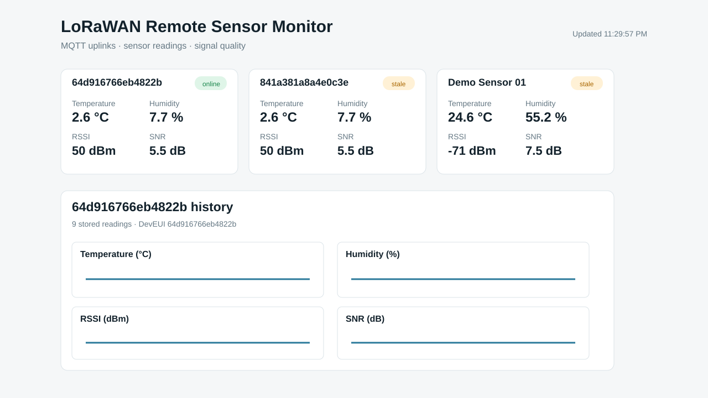

# LoRaWAN Remote Sensor Monitor

A compact end-to-end IoT monitoring project built with **Python, MQTT, SQLite, Docker, and ChirpStack v4**.

The monitor consumes ChirpStack application uplink events, validates and decodes telemetry, persists readings in SQLite, exposes REST endpoints, tracks device health, and renders historical telemetry in a browser dashboard.


## Links

- Portfolio: https://faizankhan107.github.io
- Repository: https://github.com/faizankhan107/lorawan-iot-monitor

> **Validation scope:** the full LoRaWAN path was verified with **ChirpStack Simulator** using simulated OTAA device activation and simulated gateway traffic. Physical RF gateway/device and range testing are not claimed.

## What was verified

- Local ChirpStack v4 stack running with Docker
- EU868 gateway path
- OTAA activation with ChirpStack Simulator
- ChirpStack-processed application uplinks delivered over MQTT
- Python MQTT subscriber and reconnect handling
- SQLite telemetry persistence
- Temperature, humidity, RSSI and SNR parsing
- Online / stale device state
- Historical telemetry API and browser charts
- `/health` endpoint for database and MQTT state
- Accepted / rejected message counters
- Malformed-payload rejection
- 9 automated unit tests covering codec, ingestion, persistence, staleness and health behavior

## Architecture

```text
Simulated LoRaWAN end device
          |
          v
Simulated gateway
          |
          v
     ChirpStack v4
          |
          v
Application MQTT event
          |
          v
     Python monitor
       /       \
      v         v
   SQLite     REST API
                 |
                 v
          Browser dashboard
```

## Dashboard

The dashboard shows the latest device telemetry and historical charts for temperature, humidity, RSSI, SNR, and last-seen / online / stale status.



*Running project dashboard during ChirpStack-simulated LoRaWAN validation.*

## Project structure

```text
lorawan-iot-monitor/
├─ .vscode/
│  └─ settings.json
├─ monitor/
│  ├─ app.py
│  ├─ codec.py
│  ├─ index.html
│  ├─ ingest.py
│  └─ __init__.py
├─ simulator/
│  ├─ sensor_simulator.py
│  └─ __init__.py
├─ tests/
│  └─ test_monitor.py
├─ compose.yaml
├─ Dockerfile
├─ mosquitto.conf
├─ requirements.txt
├─ verify_demo.py
├─ CV_ENTRY.md
└─ README.md
```

## Payload format

The sample binary sensor payload is four bytes, big-endian:

- signed 16-bit temperature × 100
- unsigned 16-bit relative humidity × 100

The monitor also accepts decoded ChirpStack JSON objects containing `temperature_c` and `humidity_pct`.

Supported MQTT topic forms include:

```text
demo/<id>/device/<DEV_EUI>/event/up
application/<application-id>/device/<DEV_EUI>/event/up
```

## Quick local demo

Requirements:

- Docker Desktop / Docker Compose

From the repository root:

```bash
docker compose --profile demo up --build -d
```

Then open `http://localhost:8000`. Health endpoint: `http://localhost:8000/health`.

Stop the demo with:

```bash
docker compose --profile demo down
```

The bundled demo simulator publishes synthetic MQTT events directly to the local broker. It is useful for testing the application layer, but it is separate from the ChirpStack Simulator validation described below.

## Run the monitor against ChirpStack

Create a Python environment and install dependencies:

```bash
python -m venv .venv
```

Windows PowerShell:

```powershell
.\.venv\Scripts\Activate.ps1
pip install -r requirements.txt
```

Set the MQTT broker and dashboard port:

```powershell
$env:MQTT_HOST="localhost"
$env:MQTT_PORT="1883"
$env:DB_PATH="$PWD\chirpstack-telemetry.db"
$env:PORT="8001"
python -m monitor.app
```

The demonstrated setup used port `8001` because another local application occupied port `8000`.

## ChirpStack validation performed

A local ChirpStack v4 Docker stack was configured with EU868. ChirpStack Simulator was then used to create a simulated gateway and OTAA device. The device successfully activated and generated uplinks that were processed by ChirpStack and published as application MQTT events. The monitor consumed those events and displayed the resulting telemetry in the dashboard.

This validates the software path:

```text
simulated LoRaWAN device
→ simulated gateway
→ ChirpStack
→ application MQTT event
→ monitor
→ SQLite
→ dashboard
```

It does **not** validate real RF propagation or physical gateway range.

## Automated tests

After installing `requirements.txt`:

```bash
python -m unittest discover -s tests -v
```

## Reliability details

The monitor binds the HTTP port **before** starting the MQTT subscriber. This prevents a duplicate process from connecting with the same MQTT client ID when the dashboard port is already occupied, avoiding MQTT session-takeover loops.

`/health` returns HTTP 200 when the database is healthy and MQTT is connected, and HTTP 503 when the service is degraded.

## Security notes

The included Mosquitto configuration is intended for local development. Do not expose an anonymous broker directly to the public internet. For deployment, add authentication, TLS, firewall rules and proper secret management.

Local databases, virtual environments, environment files, Python caches, keys and local ChirpStack simulator configuration are excluded by `.gitignore`.

## Portfolio summary

Built a Dockerized IoT monitoring system integrated with ChirpStack v4, supporting simulated OTAA LoRaWAN device activation and end-to-end uplink processing through MQTT, SQLite persistence, REST APIs, device health monitoring and historical telemetry visualization.
